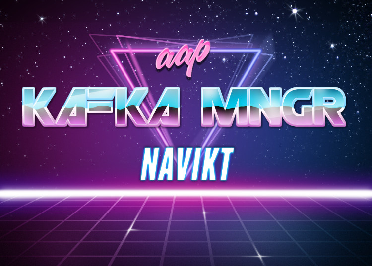

## Legg til topic
1. Legg til topic config nederst i [nais.yml](nais.yml) <br>
NB ⚠️ topic-json lista kan ikke slutte med et komma.

2. Legg til denne appen i avien topic.yml ACL definisjon <br>
```yaml
- team: aap
  application: aap-kafka-manager
  access: read
```

## Legg til bruker
Folk i AD Gruppa `aap`: [Azure AD](http://mygroups.microsoft.com/)

### Creds
https://github.com/navikt/kafka-manager
